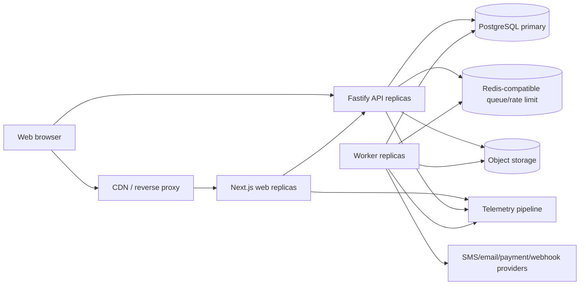
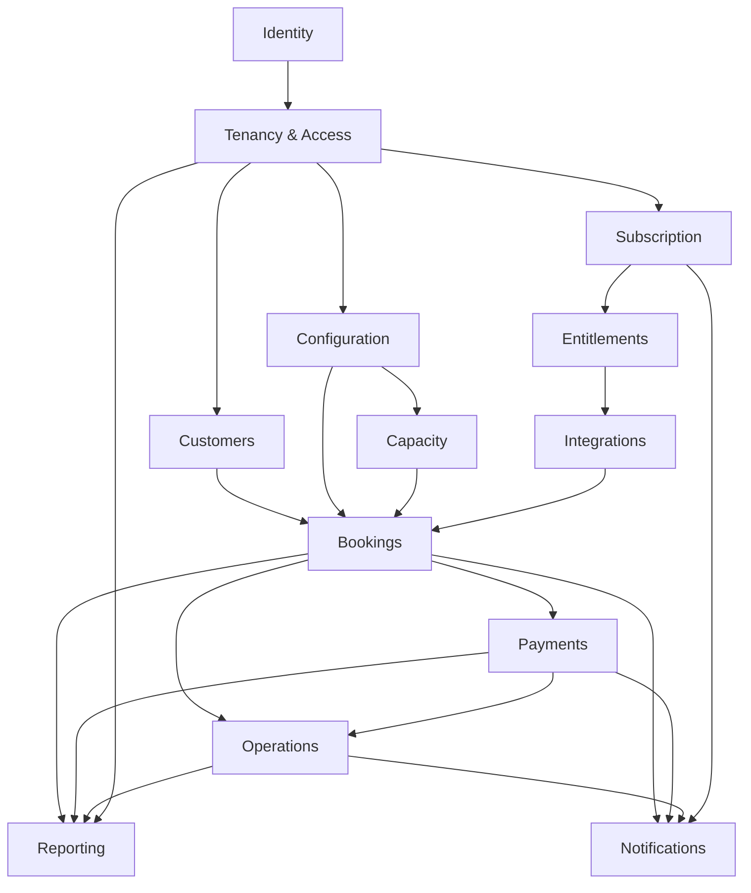

# Application Topology and Module Contracts

Status: Phase 3 application architecture baseline

## Runtime topology



Web never receives database credentials. API and worker are the only ordinary
application processes that access domain persistence.

## Logical repository shape

Phase 4 may adjust names, but the dependency direction is fixed:

```text
apps/
  web/                Next.js routes, UI, first-party client
  api/                Fastify composition and HTTP adapters
  worker/             Queue/outbox/scheduled handler composition

packages/
  contracts/          Runtime schemas, OpenAPI inputs, generated-client source
  domain/             Pure value objects, entities, rules, domain errors/events
  application/        Commands, queries, ports, authorization orchestration
  persistence/        PostgreSQL repositories, transactions, migrations
  integrations/       OTP, notification, storage, future payment adapters
  observability/      Correlation, metrics, traces, redacted logging
  testkit/            Six archetype fixtures, builders, concurrency helpers
  ui/                 shadcn primitives, semantic tokens, shared visual components
```

Domain/application packages do not import Next.js, Fastify, queue, provider SDK,
or database-driver types.

The UI package follows
[ADR-013](adrs/ADR-013-shadcn-ui-design-system.md). It owns shadcn-generated
source and low-level composition. Web feature code owns workflow composition;
neither layer owns server authorization or domain invariants.

## Layer rules

```text
Delivery adapter (HTTP/worker)
        ↓
Application use case
        ↓
Domain model + ports
        ↓
Persistence/provider adapter
```

- Delivery validates transport shape, authenticates, creates ActorContext, and
  maps domain results to safe protocol responses.
- Application use cases authorize, coordinate aggregate/repository calls, own
  transaction boundaries, and emit outbox events.
- Domain contains deterministic rules and state transitions.
- Adapters implement repositories, clock/ID generation, queues, storage, and
  external providers.
- A module does not reach through another module’s adapter/table.

## Module dependency map



The arrows mean “may use a published contract,” not unrestricted imports.
Potential cycles such as Integration → Booking → Notification → webhook
delivery are broken through application ports and outbox events.

## Published module contracts

Each module may expose:

```text
Commands        imperative state-changing use cases
Queries         scoped read contracts
Domain types    stable value objects/IDs needed by callers
Events          facts after commit
Ports           required capability interfaces
```

It does not expose:

- ORM models;
- mutable aggregate internals;
- unscoped repository access;
- provider SDK objects;
- raw tables;
- internal event payloads as automatic public webhooks.

## Command pattern

Example:

```text
CreateBookingCommand
  actor
  businessId
  venueId
  offeringId
  resourceId
  start/end
  customer/contact input
  source
  payment requirement input where permitted
  idempotency identity
```

Result:

```text
booking ID/code
commitment state
attendance state
payment/verification summary
exact total/paid/due
assignment
deadline
version
```

The command does not accept precomputed authoritative price, permission,
availability, or tenant identity from the client.

## Query pattern

Queries accept ActorContext plus allow-listed filters. Repository queries carry
mandatory tenant/venue scope types so an unscoped query is awkward or
impossible.

Separate read models may optimize:

- Today attention/timeline;
- calendar availability;
- owner overview;
- verification/reconciliation queues;
- partner/public published representation.

They return freshness/checkpoint where asynchronous and never handle protected
mutations.

## Transaction boundary

An application transaction runner:

1. opens a PostgreSQL transaction;
2. establishes verified tenant/actor/system context;
3. locks/loads idempotency;
4. invokes module repositories/domain rules;
5. writes audit and outbox;
6. stores idempotent result;
7. commits/rolls back;
8. maps known SQL concurrency outcomes to domain results.

No use case opens nested independent transactions. Repository calls receive the
transaction context explicitly.

## API process responsibilities

- HTTPS termination awareness/trusted proxy configuration;
- request size/time limits;
- authentication and rate limits;
- runtime schema validation and serialization;
- ActorContext establishment;
- command/query execution;
- idempotency and safe errors;
- structured metrics/traces/logging;
- graceful readiness/drain/shutdown.

It does not run unbounded exports, wait on notification delivery, or hold a
transaction while calling an external provider.

## Worker process responsibilities

- outbox relay/handler execution;
- hold/pending/subscription transitions;
- notification/webhook delivery;
- report/export jobs;
- projection maintenance/rebuild;
- retention/cleanup work;
- retries, dead-letter visibility, and job metrics.

Worker commands reuse the same application use cases under a verified system
ActorContext and never bypass domain transitions.

## Web process responsibilities

- public/staff routing and rendering;
- accessibility, responsive interaction, client state;
- secure session transport integration;
- generated API client;
- safe caching of published/static content;
- no privileged business rule or database path.

Next.js server rendering may call the API over a private/co-located network.
Server components do not import persistence or mutate domain records directly.

## Dependency enforcement

Phase 4 adds:

- TypeScript project/package boundaries;
- lint/import rules preventing forbidden direction;
- package public exports;
- architecture tests;
- no circular dependency gate;
- contract schema diff checks;
- database access allowed only from persistence adapters;
- provider SDK imports allowed only from integration adapters.

## Scaling units

| Component | Scale signal | State rule |
|---|---|---|
| Web | Request/concurrency/CPU latency | Stateless apart from external session/cache |
| API | Request concurrency, CPU, p95/p99, DB pool saturation | Stateless; idempotency/database own durable state |
| Worker | Queue age/depth, job duration, provider quota | Jobs leased/idempotent; replicas safe |
| PostgreSQL | CPU/IO/locks/connections/query latency/storage | Primary write authority |
| Redis | Queue/rate-limit/cache latency/memory | Replaceable; cache loss cannot corrupt truth |
| Object storage | Export/assets volume | Private by default; signed access |

API and worker replica counts respect one global PostgreSQL connection budget.
Autoscaling processes without connection-pool control is prohibited.
