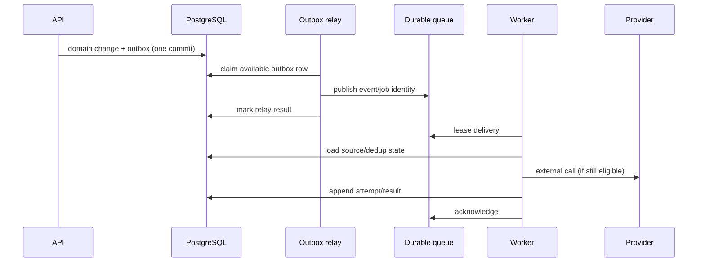

# Background Jobs and Integration Architecture

Status: Phase 3 selected asynchronous baseline

## Principles

- Database commit is the source event.
- Outbox makes post-commit work durable.
- Queue/job delivery is at-least-once.
- Every handler is idempotent.
- Scheduled work rechecks current source eligibility.
- Provider failure never invents or reverses domain truth.
- Tenant, correlation, causation, and schema version travel with every job.

## Processing pipeline



The initial queue adapter is BullMQ over managed Valkey. The relay may also
execute selected internal handlers directly if the durable state/lease
semantics remain equivalent. Application modules depend on outbox/job
contracts, not BullMQ types.

## Job catalogue

| Job | Trigger | Idempotency identity | Eligibility/recovery |
|---|---|---|---|
| Hold expiry | `expires_at` due or delayed scan | Checkout/claim + terminal version | Lock/recheck Active and expiry; no-op if consumed/released |
| Pending booking expiry | Booking deadline due | Booking + commitment version | No-op if confirmed/cancelled; release claim atomically |
| Booking reminder | Scheduled from confirmed booking | Booking + schedule revision + reminder type | Suppress if cancelled/rescheduled/completed/ineligible |
| Payment verification attention | Manual attempt submitted | Attempt + submitted version | Resolve/suppress when verified/rejected |
| Notification delivery | Logical notification ready | Notification + recipient + channel + event version | Append attempts; do not duplicate provider request where provider supports key |
| Webhook delivery | External event projection | Event ID + subscription | Signed, retried, deduplicated by receiver/event ID |
| Outbox relay | Domain commit | Outbox message ID | Concurrent `SKIP LOCKED`/lease; publish repeatedly safely |
| Report export | Authorized export request | Export request ID | Reauthorize request snapshot/policy, generate private artifact, expire link |
| Projection update | Source event/checkpoint | Projection + event/aggregate version | Apply only next/new version; rebuildable |
| Subscription transition | Due/grace/restriction instant | Subscription + expected version/state | Lock/recheck; one transition/audit/outbox |
| Handover escalation | Unacknowledged deadline | Handover + escalation level | Suppress after acknowledgement/resolution |
| Retention cleanup | Policy schedule | Data class + partition/batch | Dry-run/metrics; never delete protected finance/audit without approved policy |
| Webhook verification | New endpoint | Subscription + verification nonce | Bound attempts; endpoint remains inactive until verified |

## Scheduling

Do not create one infrastructure cron schedule per booking.

Use:

- indexed due-time tables queried in bounded batches;
- queue delayed jobs as an optimization, not the sole durable schedule;
- periodic sweepers that recover missed/delayed queue entries;
- database/server time as authority;
- lease ownership and `FOR UPDATE SKIP LOCKED`-style concurrent claiming.

When a queue-native schedule is useful, use BullMQ Job Schedulers rather than
deprecated repeatable-job APIs. Database due-time state and sweepers remain the
recovery authority.

This ensures a queue outage or deployment does not permanently lose expiries.

## Job state and attempts

Logical job/event state and attempts are separate:

```text
READY
PROCESSING (lease owner + lease expiry)
RETRY_SCHEDULED
SUCCEEDED
FAILED_TERMINAL
SUPPRESSED
```

Each attempt records start/end, safe error class, provider reference where
applicable, and next retry. Raw secrets or full personal message content are not
stored in queue payloads/logs.

## Retry policy

| Failure | Treatment |
|---|---|
| Timeout/network/5xx | Exponential backoff with jitter and maximum age/attempt |
| Provider 429/quota | Respect retry hint; reduce concurrency/circuit-break |
| Invalid destination/permanent 4xx | Terminal failure; visible operational result |
| Authentication/configuration failure | Pause affected adapter/tenant path and alert |
| Domain no longer eligible | Suppressed, not failed |
| Database serialization/deadlock | Bounded whole-transaction retry |
| Unknown external result | Query provider by idempotency/reference where supported before retry |
| Poison payload/schema | Quarantine/dead-letter with alert; never infinite hot loop |

Retry parameters are per job/provider class. A reminder can expire as useless;
a payment callback/audit reconciliation may require longer recovery.

## Concurrency controls

- Per-provider and per-tenant concurrency limits prevent one tenant from
  consuming the whole worker pool.
- Jobs for one aggregate use version checks, not global ordering assumptions.
- Resource mutations still use database guards/constraints.
- Webhook endpoints have per-installation concurrency/backoff.
- Worker autoscaling respects database connection and provider quotas.
- Long export/projection jobs use checkpoints and bounded batches.

## Provider adapter boundary

```text
NotificationPort
  sendTransactional(message, idempotencyIdentity)

OtpPort
  sendChallenge(destination, purpose, providerKey)

ObjectStoragePort
  putPrivate/getSigned/delete

PaymentProviderPort (future)
  createAttempt/queryAttempt/refund/verifyWebhook

WebhookDeliveryPort
  signAndSend(subscription, event)
```

Adapters translate provider-specific outcomes into stable application result
codes. Provider SDK types never enter domain/application packages.

## Circuit breakers and degradation

- Provider-wide failure opens a bounded circuit and stops hammering the vendor.
- Booking commits remain successful when notifications are degraded.
- Public checkout cannot promise OTP success when all configured OTP routes are
  unavailable; it returns a safe retry/fallback result and does not confirm.
- Redis/cache loss falls back to database-correct paths where feasible; queue
  backlog is recovered from outbox/due-time tables.
- Export/report projection delays show freshness and do not present stale data
  as current.

## Webhooks

External delivery:

- HTTPS only;
- endpoint verification before activation;
- HMAC or asymmetric signature with timestamp/key ID;
- replay tolerance window and event ID;
- no secret in URL;
- allow-listed event types/scopes;
- privacy-minimal versioned payload;
- at-least-once delivery;
- observable attempts and owner-controlled disable/rotation.

Webhook payloads never include internal audit, unrestricted customer, raw
payment reference, or another venue’s data.

## Queue payload policy

Queue payloads carry references and safe routing metadata:

```json
{
  "jobId": "opaque",
  "type": "notification.deliver",
  "businessId": "opaque",
  "subjectId": "opaque",
  "schemaVersion": 1,
  "correlationId": "opaque"
}
```

The worker loads authoritative current data under tenant context. Personal
content and mutable business truth are not copied unnecessarily into Redis.

## Observability

Metrics by job type and safe tenant tier—not personal identifiers:

- ready/processing/retry/dead counts;
- oldest job age;
- execution and provider latency;
- success/suppression/terminal-failure rate;
- retry count and circuit state;
- outbox-to-processing delay;
- expiry lateness;
- webhook/notification delivery outcome.

Alerts use both failure rate and backlog age. A quiet worker that stopped
processing is detected even if it emits no errors.

## Testing

- fake clock for due-time boundaries;
- handler run twice/ten times produces one logical effect;
- crash before provider call, after provider call, and before local result save;
- provider timeout/429/5xx/permanent 4xx;
- outbox relay duplicate publish;
- queue unavailable then recovery from database;
- worker replicas claiming the same batch;
- source changes before scheduled execution;
- poison schema and dead-letter alert;
- per-tenant fairness under one abusive/noisy tenant.
