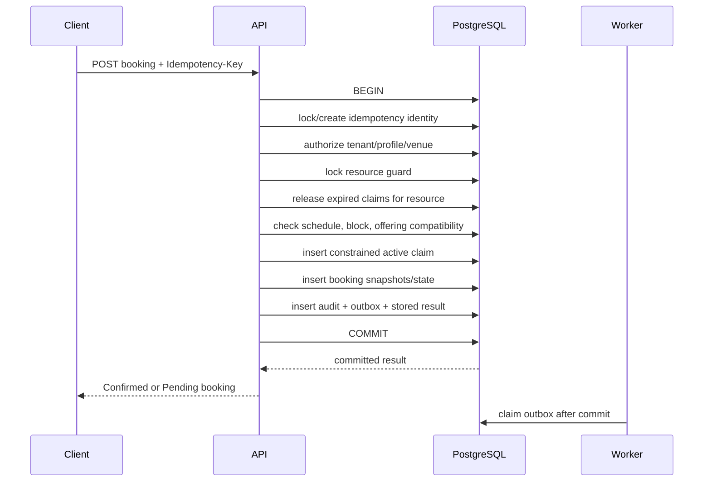

# Booking Capacity and Concurrency Design

Status: Phase 3 invariant proof

## Safety objective

For one independent resource:

> At every committed database state, no two active capacity claims overlap.

This must hold across staff booking, public holds, pending reservations,
confirmed bookings, reschedule, extension, reassignment, expiry workers,
retries, API replicas, and resource blocks.

## Why an availability check is insufficient

Two requests can both read “available” before either writes. Correctness
therefore lives in the committing database transaction and constraint, not the
calendar response, Redis lock, API process, or UI.

Public/staff availability is advisory until commit:

```text
Generate candidate availability
→ user selects
→ command begins
→ acquire resource guard
→ release eligible expired claims
→ recheck schedule/block/policy
→ insert or mutate constrained claim
→ commit
```

## Core persistence concept

Illustrative schema, not final migration:

```sql
CREATE EXTENSION IF NOT EXISTS btree_gist;

CREATE TABLE resource_capacity_claims (
  id uuid PRIMARY KEY,
  business_id uuid NOT NULL,
  venue_id uuid NOT NULL,
  resource_id uuid NOT NULL,
  owner_kind text NOT NULL CHECK (owner_kind IN ('CHECKOUT', 'BOOKING')),
  owner_id uuid NOT NULL,
  during tstzrange NOT NULL,
  acquired_at timestamptz NOT NULL,
  expires_at timestamptz,
  released_at timestamptz,
  release_reason text,
  CHECK (NOT isempty(during)),
  CHECK (lower_inc(during) AND NOT upper_inc(during)),
  CHECK (lower(during) < upper(during))
);

ALTER TABLE resource_capacity_claims
ADD CONSTRAINT no_overlapping_active_resource_claim
EXCLUDE USING gist (
  business_id WITH =,
  resource_id WITH =,
  during WITH &&
)
WHERE (released_at IS NULL);
```

Tenant-safe foreign keys and indexes will be added in the logical/physical data
design. The exclusion constraint is the final overlap authority.

## Explicit expiry

The constraint cannot safely define “active” as `expires_at > now()` because
index predicates cannot depend on advancing wall-clock truth.

Therefore:

- a hold has `expires_at`;
- it remains physically capacity-reserving until a transaction sets
  `released_at`;
- the expiry worker releases it explicitly;
- a competing booking transaction may opportunistically release an already
  expired claim for the same locked resource before inserting;
- completing checkout and expiring the hold race under locks and only one
  terminal result commits.

This can make a slot unavailable for a short worker delay, but never makes an
expired slot double-bookable.

## Resource mutation guard

The resource row, or a dedicated one-row-per-resource guard, is locked with
`SELECT ... FOR UPDATE` for:

- claim creation;
- hold consumption;
- reschedule, extension, reassignment, cancellation release;
- resource block creation/edit/resolution;
- relevant resource deactivation.

The guard solves a different problem than the exclusion constraint:

- the exclusion constraint prevents claim-versus-claim overlap;
- the guard orders claims against blocks and configuration state that may
  legitimately overlap existing claims.

For commands involving two resources, acquire guard locks in stable sorted
resource-ID order to prevent deadlocks.

## Create staff booking



If the exclusion constraint rejects the insert, the transaction returns
`BOOKING_SLOT_CONFLICT`; no partial customer, booking, payment, or notification
truth is committed.

## Public hold and checkout completion

### Acquire

1. Authorize/rate-limit checkout context.
2. Begin transaction and lock target resource.
3. Release eligible expired claims under that guard.
4. Recheck published offering, schedule, price, policy, and blocks.
5. Insert active claim owned by CheckoutSession with exact expiry.
6. Commit checkout/claim/audit/outbox.

### Consume without a gap

1. Begin idempotent completion transaction.
2. Lock checkout, capacity claim, and resource guard.
3. Recheck that checkout is Active and not expired.
4. Recheck contact verification and commercial requirements.
5. Create Booking with snapshots.
6. Update the same claim owner from CheckoutSession to Booking and clear hold
   expiry; it remains active throughout the transaction.
7. Mark checkout Completed.
8. Commit audit, stored result, and outbox.

### Expiry race

Checkout completion and expiry both lock the checkout/claim. Whichever commits
first determines the result:

- completion first: worker sees Completed/booking-owned claim and no-ops;
- expiry first: completion returns `HOLD_EXPIRED`, with no booking created.

## Reschedule and reassignment

1. Lock idempotency and Booking.
2. Lock old and new resource guards in sorted order.
3. Release unrelated expired claims under relevant guards.
4. Recheck target schedule, block, compatibility, price, and policy.
5. Update the existing active claim’s resource/range.
6. Let the exclusion constraint test the target.
7. Append BookingRevision, snapshots/difference, audit, and outbox.
8. Commit.

If target conflict occurs, the entire transaction rolls back, including the
claim update; the old assignment remains active and unchanged.

## Extension

Extension updates only the upper bound of the active claim after locking the
resource. The exclusion constraint rejects overlap with the following claim.
The booking revision records old/new end, added price, and resulting due.

## Cancellation and pending expiry

The transaction:

- locks Booking and resource;
- validates one allowed terminal transition;
- sets claim `released_at` and reason;
- changes booking commitment state;
- appends audit/outbox.

Refund, forfeiture, or due resolution is not inferred. If a financial
transaction is explicitly recorded in the same user command, it follows
financial permissions and invariants; provider execution remains outside.

## Resource blocks

Resource blocks are stored separately from CapacityClaim because an urgent
safety block may overlap existing bookings.

Creation:

1. Lock resource guard.
2. Insert active block.
3. Query intersecting active booking claims.
4. Create one affected-booking resolution item per intersection.
5. Commit block, work items, audit, and outbox.

New capacity commands lock the same resource and reject intersection with the
active block. A block transaction and booking transaction therefore cannot pass
each other unnoticed.

## Transaction isolation and retries

Use short explicit transactions with row locks and constraints under the normal
supported isolation chosen during implementation. Serializable isolation may
be used for workflows whose predicates cannot be protected cleanly otherwise.

The application has a bounded retry policy for:

| SQL outcome | Treatment |
|---|---|
| Exclusion violation (`23P01`) | Expected domain conflict; do not blindly retry the same unavailable target |
| Serialization failure (`40001`) | Retry whole idempotent transaction with jitter and bound |
| Deadlock (`40P01`) | Retry whole idempotent transaction; investigate if recurring |
| Connection/unknown commit result | Resolve through idempotency record before resubmitting |
| Validation/permission failure | Never retry automatically |

Retries always rerun authorization and current-state validation.

## Idempotency behavior

The idempotency record includes:

```text
business/caller scope
operation name
client key
canonical request hash
state: IN_PROGRESS | COMPLETED | FAILED_RETRYABLE
stored status/result reference
expiry/retention
```

- Equivalent repeated request returns the committed result.
- Same key with a different hash returns `IDEMPOTENCY_KEY_REUSED`.
- A process crash after commit is resolved from the stored result.
- Keys are scoped so another tenant/caller cannot discover or reuse them.

## Availability read model

Availability derives candidate intervals from:

```text
effective venue/resource schedule
- schedule exceptions
- active resource blocks
- active capacity claims
= candidate available intervals
→ resolve offering compatibility and price/policy display
```

The read path may be cached briefly, but commit always rechecks PostgreSQL.
Cache invalidation events follow schedule, price, block, claim, and publication
changes. Stale cache can cause a safe conflict, never double booking.

## Safety proof by race

| Race | Why at most one unsafe result cannot commit |
|---|---|
| Booking vs booking | Exclusion constraint rejects overlapping active claim |
| Hold vs booking | Both create constrained active claims |
| Hold completion vs expiry | Same checkout/claim lock; one terminal transition |
| Extension vs following booking | Updated range is checked by exclusion constraint |
| Reschedule vs target booking | Claim update/insert is constraint protected; rollback keeps original |
| Reassign A→B vs B→A | Stable ordered resource locks plus constraints prevent deadlock/overlap |
| New booking vs urgent block | Both acquire the same resource guard; later transaction sees committed block/claim |
| Duplicate request/callback | Idempotency/provider identity returns one logical effect |
| Worker retry after partial failure | Business transition, outbox, and stored result are atomic/idempotent |

## Required engineering proof

Before implementing the full booking UI:

1. Create a minimal PostgreSQL migration with the range/exclusion invariant.
2. Run at least 50 concurrent claim attempts for one resource/interval.
3. Prove exactly one active claim commits.
4. Test back-to-back `[18:00,19:00)` and `[19:00,20:00)` both commit.
5. Test completion-versus-expiry and block-versus-booking races repeatedly.
6. Test reschedule failure preserves the original claim.
7. Kill the API around commit and prove idempotent result recovery.
8. Record query plans and p95/p99 transaction latency under the Phase 2 fixture.
