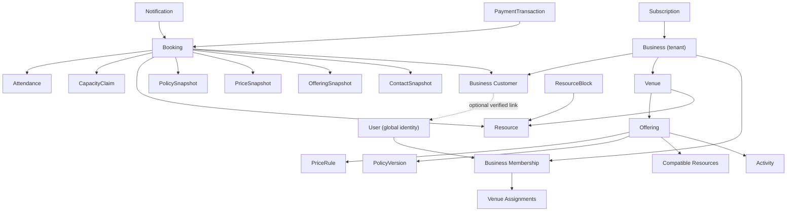

# Domain Model, Aggregates, and Invariants

Status: Phase 3 domain baseline

## Modeling approach

The model separates:

- **identity** — who a person is globally;
- **tenant relationship** — how that person relates to a business;
- **configuration** — what the venue offers and under which rules;
- **capacity** — which resource intervals are unavailable;
- **booking commitment** — what was promised and to whom;
- **attendance** — what happened operationally;
- **money** — what was submitted, verified, collected, corrected, or refunded;
- **communication** — what notification was requested and delivered;
- **subscription** — whether the business may use SaaS capabilities.

An aggregate owns business rules and mutation entry points. A database
transaction may coordinate more than one aggregate when a documented invariant
requires atomicity, such as creating a booking and its capacity claim.

## Bounded modules

| Module | Owns | Does not own |
|---|---|---|
| Identity | Application user/security state, Better Auth adapter, session/OTP orchestration | Business permissions or customer history |
| Tenancy & Access | Business, membership, access profile, venue assignment, invitation | Global authentication mechanics |
| Venue Configuration | Venue, activity, resource, offering, schedule, price and policy versions, amenities/add-ons | Live booking or payment history |
| Availability & Capacity | Capacity claims, resource blocks, availability calculation | Booking commercial snapshot |
| Bookings | Booking commitment, assignment history, contact/price/policy snapshots, attendance | Payment transaction truth |
| Customers & Contacts | Tenant-local customer relationship, normalized contact, restrictions, merge history | Global reputation across businesses |
| Payments & Reconciliation | Payment attempts, verification, financial transactions, allocations, cash sessions | Booking lifecycle or SaaS invoices |
| Today Operations | Operational queries, issues/incidents, handover, attention items | Canonical booking/payment facts |
| Reporting & Audit | Read projections, metric definitions, protected audit entries | Source mutation authority |
| Notifications | Logical notifications, templates, recipient/channel attempts | Booking/payment state transitions |
| Subscriptions & Entitlements | SaaS subscription, plan/entitlement grant, invoice/payment ledger | Venue customer payments |
| Platform Administration | Safe tenant metadata and audited platform actions | Ordinary tenant customer/booking browsing |
| Integrations | Partner installations, credentials, scopes, webhook subscriptions/delivery | Bypassing application use cases |

## Core relationship map

Arrows describe semantic relationships, not automatically aggregate ownership
or cascade deletion.

## Aggregate catalogue

### Identity and access

| Aggregate root | Owned records/value objects | Principal invariants |
|---|---|---|
| User | Better Auth subject link, verified-identity projection, recovery metadata, session revocation version | One global identity can have many tenant relationships; phone verification is normalized and not equivalent to business access |
| Business | Business defaults, ownership reference, lifecycle | Exactly one valid primary owner/recovery path; BDT/locale/timezone defaults are explicit |
| BusinessMembership | Profile, state, venue assignments, accepted invitation reference | Access begins only after verified acceptance; venue scope is independent of role; history survives removal |
| Invitation | Intended business, phone/identity hint, profile, scope, expiry, acceptance | Single use; cannot create access after expiry/revocation; acceptance identity must satisfy invitation policy |

### Configuration

| Aggregate root | Owned records/value objects | Principal invariants |
|---|---|---|
| Venue | Address/contact, timezone, operational-day boundary, publication state | Tenant-owned; one active pilot venue entitlement; draft data is not public |
| Resource | Activity compatibility, active state, capacity guard identity | Resource belongs to one venue; deactivation cannot orphan unresolved future bookings |
| Offering | Activity, duration, compatible resource references, public configuration | At least one compatible active resource when publishable; fixed duration in MVP |
| ScheduleVersion | Weekly hours, exceptions, fixed slot template | Generated intervals remain inside effective hours; version/effective range is explicit |
| PriceRuleSet | Default, recurring, special-date rules and precedence | Exactly one deterministic result for a bookable slot; old booking snapshots never recalculate |
| PolicyVersion | Advance, hold, pending, cancellation/reschedule rules | Immutable after use; every booking points to/snapshots one applied version |
| AddOn | Price, availability state, fulfillment semantics | Adds commercial value but not playable capacity |

Configuration is versioned where historical interpretation matters. Editing a
published rule creates a new effective version rather than rewriting the rule a
booking used.

### Customers

| Aggregate root | Owned records/value objects | Principal invariants |
|---|---|---|
| BusinessCustomer | Tenant-local profile, normalized contacts, notes/tags, restrictions, optional user link | Same person may be separate customer relationships across businesses; duplicates are warned, never auto-merged |
| CustomerMerge | Source/survivor references, preview result, actor/reason, conflict resolution | Manager permission required; source history remains traceable through aliases |

The responsible booking contact is snapshotted on Booking. Editing or merging a
customer does not rewrite the historical contact used for a commitment.

### Capacity and booking

| Aggregate root | Owned records/value objects | Principal invariants |
|---|---|---|
| CheckoutSession | Selected offering/resource/interval, verified contact context, expiry, progress | An active public checkout may own one expiring capacity claim; completion/expiry is idempotent |
| CapacityClaim | Tenant, resource, half-open time range, active/released state, owner kind/reference, expiry | Active claims cannot overlap for the same tenant/resource; hold-to-booking transfer creates no capacity gap |
| ResourceBlock | Resource, interval, reason/type, state, affected-booking resolutions | Prevents new claims; urgent block may overlap existing claims and cannot silently change bookings |
| Booking | Source, commitment state, assignment, contact/offering/price/policy snapshots, commercial totals, revision | Tenant/venue consistent; active assignment owns one active claim; state transitions are explicit and audited |
| Attendance | Booking reference, state/timestamps, operational notes | Independent of booking and payment state; completed/no-show facts do not rewrite reserved history |

CapacityClaim is the database-enforced concurrency record. Booking remains the
customer/business commitment and source of commercial history.

### Money

| Aggregate root | Owned records/value objects | Principal invariants |
|---|---|---|
| PaymentAttempt | Booking, method, amount, provider/manual reference, recipient, verification state, idempotency/provider key | A submitted claim is not successful money until its method-specific success rule is met; duplicate callbacks/references cannot double count |
| PaymentTransaction | Type, exact amount/currency, booking allocation, original transaction link, actor/reason | Append-only; reversal/refund links original; refundable/reversible limit cannot be exceeded |
| CashSession | Venue/shift, opening/closing actors, expected/count, variance, review | Expected derives from scoped source transactions; variance never creates a fake payment |

`Booking.total`, successful allocated payment transactions, reversals, and
refunds determine net paid and due. A mutable `isPaid` flag is prohibited.

### SaaS, communication, and integration

| Aggregate root | Owned records/value objects | Principal invariants |
|---|---|---|
| Subscription | State, plan reference, billing period, grace/restriction, manual invoice/payment references | Separate ledger from venue money; limits preserve data; reactivation is idempotent |
| EntitlementGrant | Feature/limit, source, effective period, reason | Centralized effective entitlement calculation; platform adjustments audited |
| Notification | Event/version, recipient, content/template reference, schedule, channel attempts | One logical event/recipient/channel identity; state rechecked before scheduled send |
| IntegrationInstallation | Business, client/partner, scopes, venue scope, credential state, webhook subscriptions | Least privilege; revocation immediate; partner cannot call ungranted first-party capabilities |

## Value objects

| Value object | Required semantics |
|---|---|
| BusinessId, VenueId, ResourceId | Opaque identifiers; never infer tenant from a client-supplied ID alone |
| Money | Integer minor units + ISO currency; exact add/subtract/allocate/compare |
| TimeRange | Start instant < end instant; half-open `[start,end)` |
| VenueLocalTime | IANA timezone + local value/fold handling where applicable |
| OperationalDate | Venue-defined business date separate from timestamp calendar date |
| NormalizedPhone | E.164-compatible normalized form plus separately stored display/input context |
| BookingCode | User-facing non-secret reference; not authorization |
| SecureToken | High-entropy, hashed-at-rest capability token with purpose/expiry/revocation |
| IdempotencyIdentity | Caller/tenant + operation + key + canonical request hash |
| ActorContext | User/client identity, business, access profile/scopes, venue scope, correlation ID |
| Snapshot | Immutable versioned JSON/columns containing only required historical facts |
| Percentage | Fixed precision and explicit rounding rule |

## Invariant catalogue

### Tenant and authorization

| Invariant | Rule |
|---|---|
| INV-TEN-001 | Every tenant-owned row carries one non-null `business_id`. |
| INV-TEN-002 | Tenant-owned references cannot point to a different business, even if an identifier is guessed. |
| INV-TEN-003 | A command resolves actor membership, permission, and venue scope before reading/mutating protected domain data. |
| INV-TEN-004 | Runtime database roles cannot own tenant tables or bypass RLS. |
| INV-TEN-005 | Platform administration is a distinct permission boundary, not universal tenant-data access. |

### Capacity and booking

| Invariant | Rule |
|---|---|
| INV-CAP-001 | No two active claims overlap on the same independent resource. |
| INV-CAP-002 | Time ranges are non-empty and half-open. |
| INV-CAP-003 | Commit revalidates schedule, compatibility, active blocks, and policy-relevant availability. |
| INV-CAP-004 | Hold consumption transfers the existing active claim without releasing a race window. |
| INV-CAP-005 | An expired/released claim does not reserve capacity; expiry is an explicit persisted transition. |
| INV-CAP-006 | Resource block creation and claim creation are ordered by the same resource-scoped database guard. |
| INV-BKG-001 | A non-cancelled/non-expired capacity-reserving booking has exactly one active assignment claim in the MVP. |
| INV-BKG-002 | Source, contact, offering, price, and policy commitment facts are immutable snapshots. |
| INV-BKG-003 | Reschedule/reassignment/extension preserves before/after history and changes capacity atomically. |
| INV-BKG-004 | Cancellation state and financial resolution are separate. |
| INV-BKG-005 | Attendance does not change booking commitment or payment truth. |

### Money

| Invariant | Rule |
|---|---|
| INV-FIN-001 | Persisted money never uses binary floating point. |
| INV-FIN-002 | Successful money is derived from append-only transactions, not mutable balance flags. |
| INV-FIN-003 | A reversal/refund cannot exceed the remaining reversible/refundable amount of its source. |
| INV-FIN-004 | Allocations sum exactly to the transaction amount under documented rounding. |
| INV-FIN-005 | Net paid and due are reproducible from booking total and linked transactions. |
| INV-FIN-006 | Manual MFS submission, verification, collection, and correction remain distinguishable. |
| INV-FIN-007 | SaaS billing and venue booking money never share ledger totals. |

### Time, audit, and retry

| Invariant | Rule |
|---|---|
| INV-TIM-001 | Stored instant, venue timezone, and operational date are never treated as interchangeable. |
| INV-TIM-002 | Schedule/rate/policy versions have explicit effective interpretation. |
| INV-AUD-001 | Sensitive changes append actor, scope, reason where required, time, subject, and before/after references. |
| INV-AUD-002 | Ordinary application roles cannot update/delete protected audit history. |
| INV-IDEM-001 | Equivalent retry returns the original logical result; changed payload reuse fails. |
| INV-IDEM-002 | Domain mutation and outbox event commit atomically. |
| INV-IDEM-003 | Background handlers and webhook/notification delivery tolerate repeated invocation. |

## Cross-aggregate transaction map

| Use case | Atomically coordinated records |
|---|---|
| Create staff booking | Idempotency record, resource guard/check, capacity claim, booking + snapshots, audit, outbox |
| Complete public checkout | Checkout/hold, contact relationship/snapshot, booking, capacity-claim ownership transfer, audit, outbox |
| Reschedule/reassign/extend | Idempotency, ordered resource guard(s), booking revision, capacity claim, price result, audit, outbox |
| Cancel/expire booking | Booking state, capacity release, audit, outbox; financial follow-up is separate unless an explicit transaction is recorded |
| Verify manual payment | Payment attempt, successful transaction/allocation if accepted, booking confirmation eligibility, audit, outbox |
| Refund/reverse | Idempotency, source transaction lock/check, correction transaction/allocation, audit, outbox |
| Create urgent block | Resource guard, block, affected-booking work items, audit, outbox |
| Change staff access | Membership/scope state, session/access revocation version, audit, outbox |

No external provider call occurs within these transactions.

## Deletion and historical policy

- Business records use lifecycle states, not cascade deletion.
- Bookings, payments, corrections, audit, and applied snapshots are protected
  history.
- Configuration referenced by history is retired/versioned, not deleted.
- Customer privacy workflows may anonymize eligible profile fields while
  preserving legally/financially necessary booking and transaction facts.
- Secure tokens and credentials are revocable and may be physically deleted
  after retention requirements.
- Hard-deletion rules require a separate retention/legal decision before beta.
