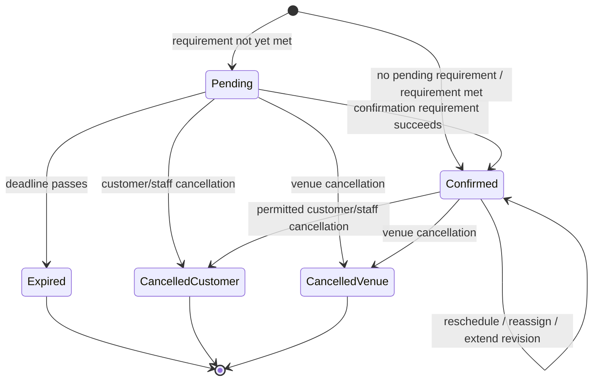
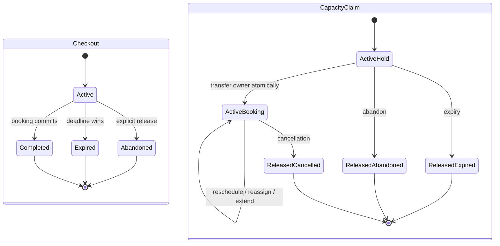
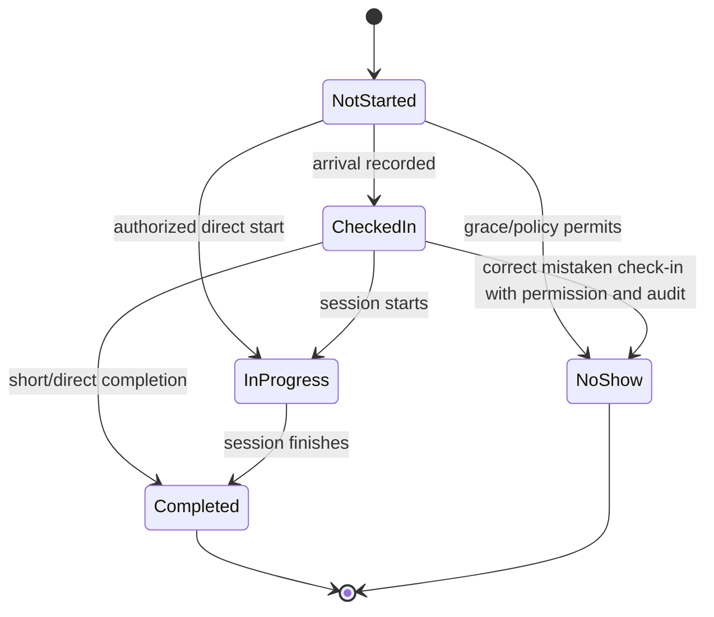
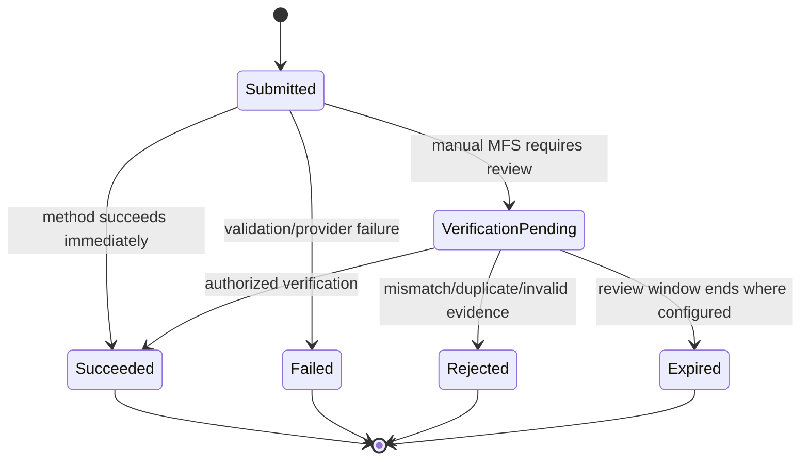
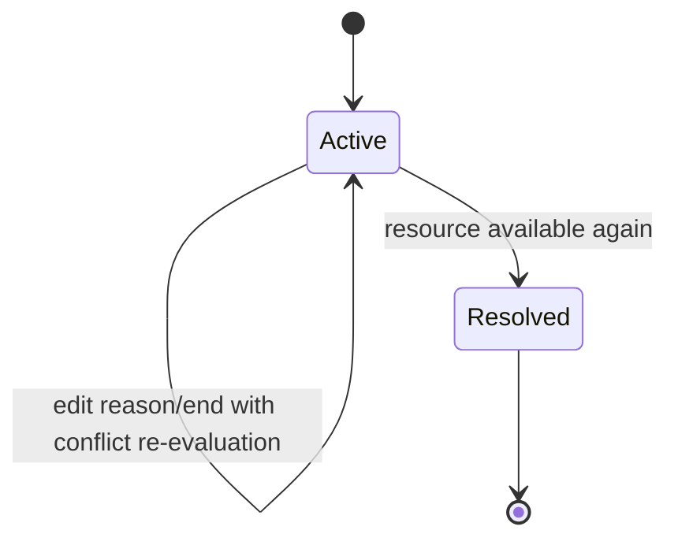
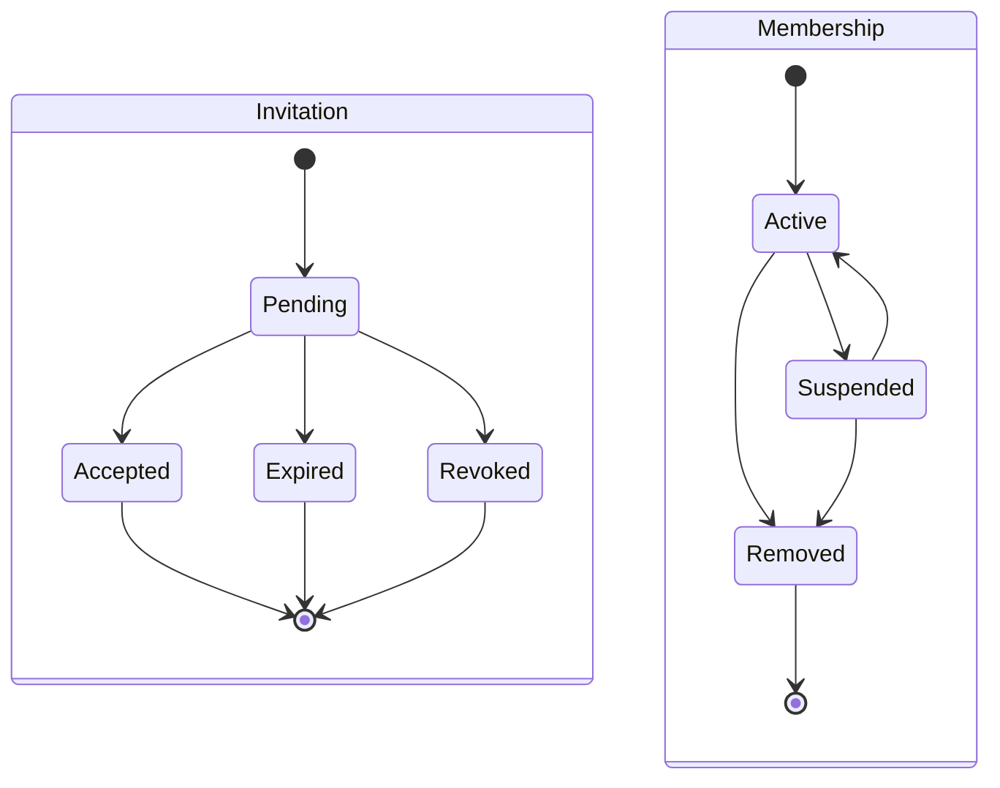
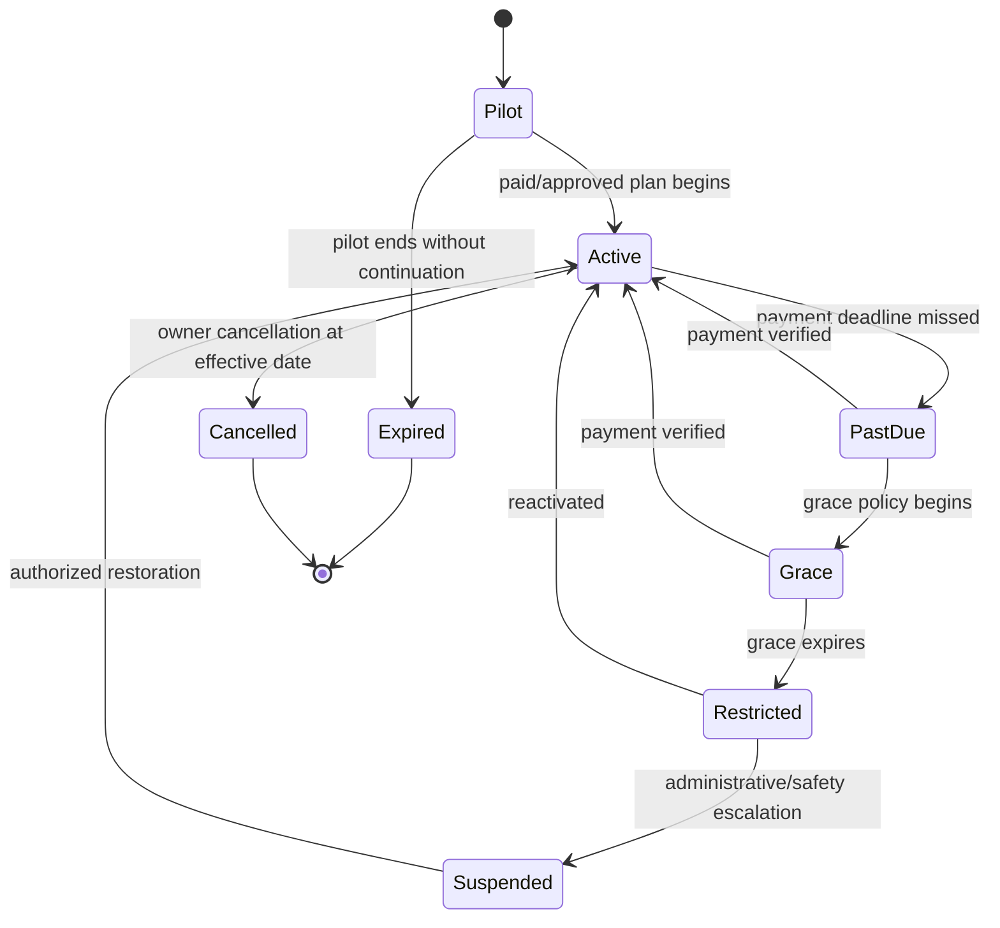
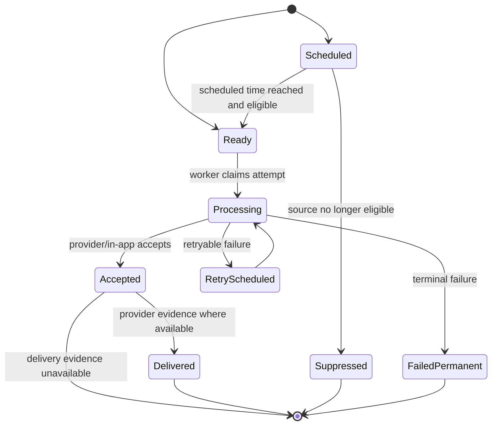
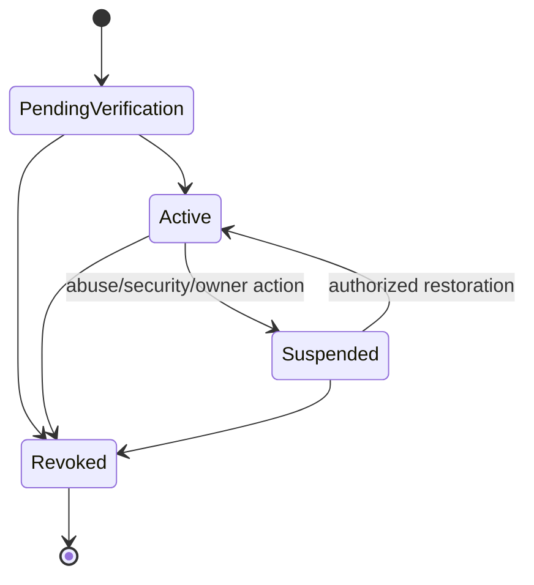

# Domain State Machines

Status: Phase 3 behavioral state baseline

## State-model rule

The system does not use one universal booking status. Commitment, capacity,
attendance, payment verification, financial balance, subscription, and
notification delivery are independent state dimensions.

## Booking commitment



Rules:

- completion and no-show do not change commitment state;
- cancellation does not itself imply refund, forfeiture, or zero due;
- a late payment after expiry follows an explicit resolution, never silently
  reactivates the expired booking;
- reschedule/reassignment/extension creates a revision while commitment may
  remain Confirmed or Pending according to explicit policy consequences.

## Checkout session and capacity claim



The claim remains active during hold-to-booking transfer. There is no moment
when another transaction can acquire the interval.

## Attendance



Late is derived attention from scheduled start, grace, and absence of check-in;
it is not a terminal attendance state. Correcting completed/no-show history is a
sensitive audited correction, not a normal transition.

## Manual mobile-payment attempt



A successful attempt creates one append-only payment transaction. Later
reversal or refund creates a new linked transaction; it does not move the
original attempt backward.

## Derived booking balance

```text
net paid =
  successful allocated collections
  - linked reversals
  - linked refunds

due = max(booking total - net paid, 0)
credit/overpayment = max(net paid - booking total, 0)
```

User-facing balance labels are derived:

```text
UNPAID | PARTIALLY_PAID | PAID | OVERPAID | REFUNDED_PARTIAL | REFUNDED_FULL
```

These labels are projections, not authoritative mutable states.

## Resource block



An active urgent block can have:

```text
0..n affected booking resolutions:
UNRESOLVED | REASSIGNED | VENUE_CANCELLED | KEPT_WITH_EXCEPTION
```

The block can be active before all resolutions complete.

## Business membership and invitation



Profile and venue-scope changes are versioned access changes while membership
is Active. They are not separate membership states.

## Subscription



Data remains intact through PastDue, Grace, Restricted, and Suspended. Each
state maps to an entitlement policy; UI banners do not enforce it.

## Notification



`Accepted` is not displayed as `Delivered` without evidence. Each attempt is
append-only; retry updates the logical notification through a new attempt.

## Integration installation



Credential rotation does not create a new installation; old credentials stop
working after the defined overlap/revocation point.

## Transition implementation rules

Every command:

1. authorizes actor/client and venue scope;
2. loads the current aggregate version;
3. validates the transition and domain preconditions;
4. commits state, audit, idempotency result, and outbox atomically where
   applicable;
5. returns the resulting independent state dimensions;
6. treats duplicate equivalent command as the same logical result.

The database uses check constraints/enums/reference tables where they improve
validity, but domain transition code remains the readable authority for why a
transition is allowed.
