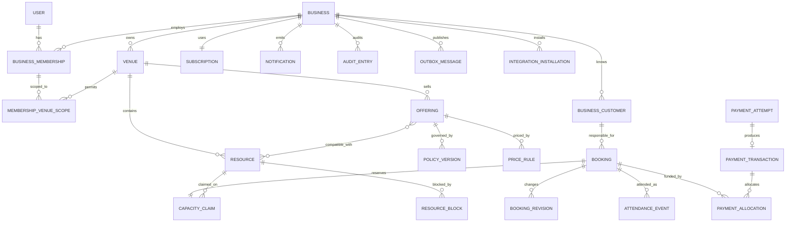

# Logical Data Model and Data Dictionary

Status: Phase 3 logical baseline

## Modeling conventions

This is a logical model. Physical column types, index names, and migration SQL
will be finalized after a PostgreSQL/driver proof in Phase 4.

| Convention | Decision |
|---|---|
| Primary IDs | Opaque time-sortable UUIDs; clients never derive meaning from them |
| Tenant ownership | Every tenant-owned table has non-null `business_id` |
| Tenant-safe relationship | Composite foreign key includes `business_id` |
| Lifecycle | State/retirement timestamps instead of cascade deletion |
| Time | Exact instants use `timestamptz`; capacity uses `tstzrange` `[)` |
| Money | `bigint` minor units + ISO currency |
| Mutable rows | `created_at`, `updated_at`, and optimistic `version` where stale edits matter |
| Historical interpretation | Immutable snapshots/version references |
| Flexible snapshot/event data | Versioned `jsonb` only where the historical shape is bounded and validated |

Globally unique IDs do not replace composite tenant foreign keys. The composite
relationship makes an accidental cross-tenant reference invalid at the database
level.

## High-level ERD



## Identity and access tables

### `users`

Global person identity, not tenant-owned.

| Logical field | Meaning |
|---|---|
| `id` | Global opaque user ID |
| `auth_subject_id` | Unique Better Auth subject mapping; no domain FK to library internals |
| `display_name` | User-controlled preferred name |
| `state` | Active, locked, disabled |
| `session_version` | Incremented to invalidate existing sessions |
| timestamps | Creation/update/last authenticated |

### `user_identity_methods` application projection

| Logical field | Meaning |
|---|---|
| `user_id` | Owning global user |
| `method` | Phone, future email/OIDC/provider |
| `normalized_identifier` | Canonical lookup identifier |
| `auth_subject_id` | Authentication subject that established the evidence |
| `verified_at` | Verification evidence time |
| `state` | Active/revoked |

One active authentication identity cannot silently belong to two users.
Shared/guardian phone data can exist as customer contact without becoming an
authentication identity. This is an application-owned security projection, not
a second credential store.

### Better Auth `auth` schema

Better Auth owns its credential, account, verification/challenge, and session
tables in a separate `auth` schema. The exact library schema is imported into
ordered reviewed migrations and is not repeated as domain tables here.

The application may store purpose/flow correlation, abuse counters, safe
delivery attempts, and audit evidence outside the auth schema, but never a
plaintext OTP or duplicate session secret. The explicit `auth_subject_id`
mapping isolates domain history from library schema changes.

### `businesses`

| Logical field | Meaning |
|---|---|
| `id` | Tenant identifier |
| `name`, `slug` | Internal/public identity |
| `currency` | Pilot `BDT` |
| `timezone` | Pilot `Asia/Dhaka` |
| `locale` | Initial display locale |
| `primary_owner_user_id` | Recovery/ownership anchor |
| `state` | Draft, active, restricted, closed |

### `business_memberships`

Composite uniqueness includes `(business_id, id)` and active user/business
relationship.

| Logical field | Meaning |
|---|---|
| `business_id`, `id`, `user_id` | Tenant relationship |
| `profile_code` | OWNER, MANAGER, BOOKING_STAFF, FINANCE_REPORTS |
| `state` | Active, suspended, removed |
| `access_version` | Incremented when permissions/scope change |
| `accepted_invitation_id` | Provenance |
| timestamps/actor | Acceptance/suspension/removal |

### `membership_venue_scopes`

`(business_id, membership_id, venue_id)` with active/effective history as
needed. Owner-wide scope is represented explicitly by profile/scope semantics,
not by copying every current/future venue row.

### `invitations`

Business, intended normalized phone/identity hint, profile, proposed venue
scope snapshot, hashed token, expiry, state, inviter, and accepted user.

## Venue configuration tables

### `venues`

Business-owned name, address/contact, timezone, operational-day boundary,
state, public slug, draft/publication references, and version.

### `business_activities`

Tenant-local activity catalogue. A later global suggestion catalogue may seed
these rows but does not own venue meaning.

### `resources`

Business/venue, name/code, activity compatibility/category, active state,
display order, version, and deactivation metadata. MVP resources are
independent; future composite/divisible relationships use separate tables
rather than overloading a parent ID now.

### `offerings`

Business/venue/activity, name, fixed duration, booking visibility, state,
default resource-selection behavior, and publication fields.

### `offering_resources`

Tenant-safe many-to-many compatibility between offering and resource, with
effective/active state.

### `schedule_versions`

Venue/resource/offering applicability, effective date range, timezone, state,
and version provenance.

### `weekly_schedule_periods`

Schedule version, weekday, local opening/closing time, slot anchor/duration, and
whether the closing time crosses midnight.

### `schedule_exceptions`

Specific local date and replacement/closed periods with reason. These are
schedule rules, not resource incident blocks.

### `price_rule_sets` and `price_rules`

Rule set/version plus ordered rules:

- applicability (offering/resource where permitted);
- recurring weekday/local time;
- specific-date override;
- fixed amount/currency;
- precedence and effective dates;
- active/version provenance.

A database/query test proves one deterministic rule result for a candidate
slot.

### `policy_versions`

Immutable structured columns/validated snapshot for:

- hold duration;
- pending deadline basis/duration;
- confirmation requirement;
- advance mode/value;
- cancellation/reschedule rules;
- due/check-in rule;
- customer restriction interaction.

### `amenities`, `venue_amenities`, `add_ons`, `offering_add_ons`

Amenities are descriptive. Add-ons have exact price/version, selection limits,
and fulfillment behavior without capacity semantics.

### `venue_publications`

Immutable published version referencing or snapshotting customer-visible venue,
offering, resource labels, policies, and contact content. Live availability
still reads current eligible configuration and claims; draft text/configuration
does not leak.

## Customer tables

### `business_customers`

Business-owned relationship with optional `linked_user_id`, display identity,
state, first-completed-booking date/projection, merge survivor/alias semantics,
and version.

### `customer_contacts`

Business/customer, type, normalized value, masked/display value, verification
evidence, primary flag, consent/communication metadata, and lifecycle.

Tenant-local search indexes normalized contact; identity linking never assumes
same contact means same person without verification.

### `customer_notes`, `customer_tags`, `customer_tag_links`

Permission-aware operational context. Restricted incident content is not stored
as an ordinary customer note.

### `customer_restrictions`

Type, active/effective period, reason, actor, and resolution. MVP includes
full-advance requirement.

### `customer_merges` and `customer_aliases`

Merge preview/result, source/survivor, actor/reason, conflict decisions, and
alias lookup. Source history is re-associated or resolved through aliases, not
deleted.

## Capacity and booking tables

### `checkout_sessions`

Business/venue, public flow token hash, selected offering/resource/range,
contact-verification context, state, expiry, publication/price/policy preview
references, idempotency/correlation, and completion booking.

### `resource_capacity_claims`

| Logical field | Meaning |
|---|---|
| `business_id`, `venue_id`, `resource_id` | Tenant-safe capacity identity |
| `owner_kind`, `owner_id` | CHECKOUT or BOOKING |
| `during` | `tstzrange` in canonical `[)` form |
| `acquired_at`, `expires_at` | Hold timing |
| `released_at`, `release_reason` | Explicit inactive transition |

One partial GiST exclusion constraint prevents overlapping rows where
`released_at IS NULL`.

### `resource_blocks`

Business/venue/resource, range, category/reason, urgent flag, active/resolved
state, actor, and version. It is separate from capacity claims so it can overlap
existing bookings intentionally.

### `block_booking_resolutions`

Block, affected booking, detected assignment/range snapshot, resolution state,
resulting booking revision/cancellation, responsible actor, and timestamps.

### `bookings`

| Logical field group | Meaning |
|---|---|
| Identity | Business/venue ID, opaque ID, user-facing booking code |
| Commitment | Pending/confirmed/cancelled/expired state, state version |
| Source | Phone, message, walk-in, staff/direct, public, future partner |
| Current assignment | Offering, resource, start/end range, operational date |
| Customer | Business customer link where present |
| Snapshots | Responsible contact, participant/team label, offering, price lines, policy |
| Commercial | Exact total/currency, required advance/deadline |
| Provenance | Creator actor/client, publication/configuration versions, timestamps |

Booking code is searchable and shareable but not a secret capability.

### `booking_revisions`

Append-only before/after revision for reschedule, reassignment, extension,
commercial adjustment, cancellation correction, and sensitive completed-record
correction. Stores reason, actor, old/new structured snapshot, and resulting
version.

### `booking_add_ons`

Add-on snapshot, quantity, exact unit/total, and fulfillment state.

### `attendance_events`

Append-only check-in/start/complete/no-show/correction events with actor,
occurred/recorded instants, operational date, and reason. Current attendance
projection may be stored on Booking or a separate one-row projection.

### `booking_notes`

Operational notes with visibility class. Restricted incidents use dedicated
incident tables and permission.

## Payment and reconciliation tables

### `payment_attempts`

Business/venue/booking, method, exact amount/currency, state, idempotency key,
manual masked/reference fingerprint, recipient account label, provider
reference, submitter/verifier, failure/rejection code, and timestamps.

Raw wallet credentials are never collected. Full manual references are
encrypted or access-restricted if storage is justified; logs and general lists
use masked/fingerprint forms.

### `payment_transactions`

Append-only successful financial facts:

| Field | Meaning |
|---|---|
| `transaction_type` | COLLECTION, REVERSAL, REFUND |
| amount/currency | Positive exact magnitude; type gives direction |
| `original_transaction_id` | Required for reversal/refund |
| method/source | Cash, manual MFS, future gateway |
| actor/reason | Correction accountability |
| occurred/recorded times | Business event vs system record |

### `payment_allocations`

Transaction-to-booking exact allocation. MVP usually allocates to one booking,
but a separate table preserves future invoice/multi-booking flexibility without
changing transaction truth.

### `cash_sessions`

Business/venue/employee shift scope, opening/closing, expected exact amount,
counted amount, variance, note, state, reviewer, and audit references.

## Operations tables

### `maintenance_issues`

Resource/venue, severity/category, description, reporter, linked block,
state/resolution, timestamps.

### `incidents`

Restricted incident content, related subject references, visibility policy,
author, state, and retention class.

### `handovers` and `handover_items`

Venue/shift, sender/recipient, note, sent/acknowledged times; each item references
an unresolved booking, payment, issue, incident, or free-text task without
copying its authoritative state.

## Reporting, reliability, and communication tables

### `audit_entries`

Append-only business, actor/client, venue scope, action, subject, reason,
occurred time, correlation, command/idempotency reference, and redacted
before/after summary or immutable source references.

### `idempotency_records`

Scope, operation, key hash, canonical request hash, processing state, locked
owner/lease where needed, response status/body reference, created/completed
times, and expiry.

### `outbox_messages`

Business, aggregate type/ID/version, event type/schema version, payload,
occurred/available time, processing attempts/state, and correlation/causation.
Inserted in the same transaction as the domain change.

### `notifications` and `notification_attempts`

Logical deduplication identity, source event/version, recipient/channel,
template/schema version, scheduled/eligibility/state; append-only attempts store
provider reference, safe outcome/error, and times.

### Read projections

Today and report projections may be added as named rebuildable tables or
materialized views. They:

- never replace source bookings/transactions;
- include business and venue scope;
- store projection checkpoint/version;
- expose reconciliation/drill-down references;
- can be rebuilt from authoritative data/events.

## Subscription tables — separate ledger

### `plans` and `plan_entitlements`

Platform-owned catalog/version of feature/limit definitions.

### `subscriptions`

Business, plan version, state, period, due/grace/restriction dates, cancellation,
reactivation, and version.

### `entitlement_grants`

Business, feature/limit override, source, exact effective period, platform
actor, and reason.

### `subscription_invoices` and `subscription_transactions`

Manual/automated SaaS billing facts. These tables do not reference or aggregate
venue booking payment transactions.

## Integration tables

### `integration_installations`

Business, partner/client, state, scopes, venue scope, rate-limit plan,
installation/rotation/revocation metadata.

### `integration_credentials`

Installation, key identifier, hashed secret/public-key metadata, created,
last-used, expiry, and revocation. Raw client secrets are shown only at creation.

### `webhook_subscriptions`

Installation, endpoint, event types, signing-secret version, state, verification
and failure policy.

### `webhook_deliveries`

Subscription, outbox/event ID, attempt number, payload schema version,
signature/key version, response class, scheduled/attempted time, and state.

## Tenant-safe foreign-key pattern

Illustrative:

```sql
ALTER TABLE resources
  ADD CONSTRAINT resources_business_id_id_uk
  UNIQUE (business_id, id);

ALTER TABLE bookings
  ADD CONSTRAINT bookings_resource_tenant_fk
  FOREIGN KEY (business_id, resource_id)
  REFERENCES resources (business_id, id);
```

The pattern applies even when `resource_id` is globally unique. It converts a
tenant-programming mistake into a constraint failure.

## Index strategy by access pattern

| Access pattern | Logical index |
|---|---|
| Today by venue/operational date | `(business_id, venue_id, operational_date, scheduled_start)` with state inclusions |
| Calendar/resource range | GiST tenant/resource/range plus supporting B-tree scope |
| Booking code lookup | `(business_id, normalized_booking_code)` unique |
| Customer phone search | `(business_id, normalized_contact)` |
| Payment verification queue | `(business_id, venue_id, state, submitted_at)` |
| Due/expiry workers | State + deadline/expiry, partitioned worker claiming |
| Audit/outbox/notification | Business + occurred/available time + state |
| Reports | Scope/date/status/source indexes driven by verified query plans |

Indexes are not added for every foreign key or filter automatically; physical
design follows query and write-amplification measurements.

## Partitioning posture

Do not partition at E0 merely for appearance. Candidate tables at measured
growth are:

- audit entries;
- outbox/event history;
- notification/webhook attempts;
- attendance events;
- payment transactions/allocations;
- old booking revisions.

Time partitioning supports retention and range scans, but tenant routing and
unique/exclusion constraints must be considered before choosing keys. The
logical `business_id` on every row keeps future tenant-cluster routing possible.

## Open physical-design proofs

Phase 4 engineering spikes must prove:

1. ORM/query layer supports composite foreign keys, ranges, partial GiST
   exclusion constraints, RLS, and transaction-local context without unsafe
   escape hatches.
2. UUID generation/order works consistently across API, worker, fixtures, and
   PostgreSQL.
3. Snapshot schemas are runtime-versioned and queryable where required.
4. RLS applies to aggregate, export, background, and migration paths correctly.
5. Query plans meet Today, availability, and report targets at E0/E1 fixtures.
