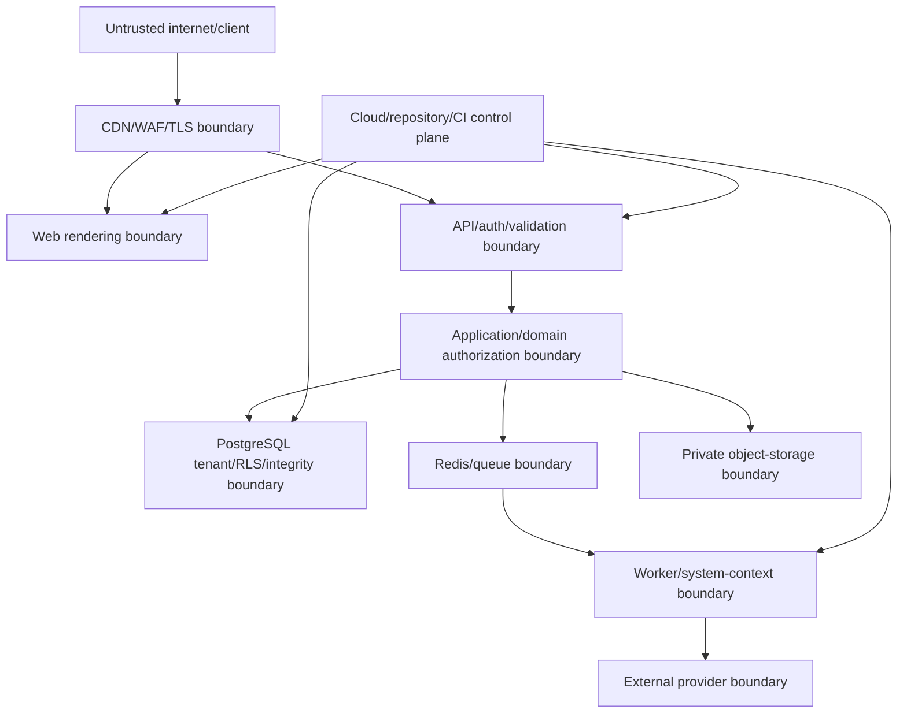

# Security and Abuse Threat Model

Status: Phase 3 baseline threat model

## Scope

Surfaces:

- business web application;
- public booking and secure booking links;
- first-party API;
- future mobile client;
- future partner API, widget, and webhooks;
- API/worker/provider integrations;
- PostgreSQL, Redis, object storage, telemetry, backups, and deployment control
  plane.

This is an engineering threat model, not a legal-compliance certification.

## Assets

Highest-value assets:

- tenant/customer isolation;
- booking capacity truth;
- payment/refund/reversal history;
- owner/staff identity and permissions;
- OTP/session/partner credentials;
- customer contacts and restricted incidents;
- subscription/entitlement state;
- audit and idempotency history;
- backups and signing/encryption secrets;
- service availability during venue operations.

## Threat actors

- unauthenticated internet attacker/bot;
- abusive/fraudulent customer;
- compromised or malicious employee;
- employee with excessive/stale access;
- malicious tenant attempting cross-tenant access;
- compromised integration/webhook endpoint;
- platform administrator abuse;
- compromised dependency/provider/control-plane account;
- accidental developer/operator mistake;
- automated retry/race that behaves like an attacker.

## Trust boundaries

Every boundary authenticates/validates its input independently. Internal network
location alone does not make a request trusted.

## Threat register

| ID | Threat | Impact | Principal controls | Verification |
|---|---|---|---|---|
| THR-001 | Guess another tenant’s booking/customer/payment ID | Privacy and financial breach | Tenant-safe FK, verified DB context, RLS, non-enumerating response | Cross-tenant endpoint/query/export suite |
| THR-002 | UI bypass sends forbidden refund/access/config command | Fraud/privilege escalation | Server permission + venue scope + reason + audit | Direct API negative tests |
| THR-003 | Tenant context leaks through pooled connection | Cross-tenant breach | Transaction-local verified context, non-owner runtime role, context-required repositories | Pool reuse stress test |
| THR-004 | Concurrent requests double-book one slot | Operational/financial harm | Resource guard, GiST exclusion, idempotency | 50+ way repeated race test |
| THR-005 | Duplicate payment/provider callback counts money twice | Financial corruption | Provider/idempotency identity, append-only ledger, uniqueness | Duplicate/reorder/retry tests |
| THR-006 | Manual MFS fake/duplicate reference | Fraud and false confirmation | Verification state, reference fingerprint/scope, reviewer permission/audit | Scenario and abuse tests |
| THR-007 | OTP brute force, flooding, or account enumeration | Account takeover/cost denial | Purpose/expiry/attempt limits, destination/IP/device controls, safe responses, provider quota | Abuse/load/security tests |
| THR-008 | SIM swap/shared phone takes historical bookings | Privacy/account takeover | Phone verification not sufficient for broad history; risk-based recovery/linking | Recovery/linking test cases |
| THR-009 | Secure booking token guessed/leaked/replayed | Customer booking exposure/change | High entropy, hash at rest, narrow purpose, expiry/revocation, no logs/referrers | Token entropy/authorization/leak tests |
| THR-010 | Session theft/CSRF/XSS | Account/tenant compromise | Secure HttpOnly SameSite cookies/token rules, CSRF defense, CSP/output encoding, session revocation | Browser security suite |
| THR-011 | Injection through API/filter/export/template | Data breach/code execution | Runtime schemas, parameterized SQL, allow-listed filters, escaping, no arbitrary expressions | SAST/fuzz/integration tests |
| THR-012 | Mass assignment changes tenant/state/price/permission | Privilege/data corruption | Command-specific schemas; server-resolved protected fields | Unexpected-field/property tests |
| THR-013 | Redis/cache poisoning/stale availability | Incorrect decisions | DB commit authority, tenant-scoped cache keys, bounded TTL/invalidation | Cache loss/stale tests |
| THR-014 | Queue replay/forged job | Duplicate/unauthorized system action | Private service, signed/trusted job identity, source reload, system context, idempotency | Replay/wrong-tenant job tests |
| THR-015 | Webhook forgery/replay/SSRF | Fraud/internal network access | Signature/timestamp/event ID, endpoint validation, egress controls, HTTPS, DNS/IP recheck | Signature/replay/SSRF tests |
| THR-016 | Malicious partner exceeds scopes/volume | Tenant data breach/DoS | Installation tenant binding, scopes, venue scope, quotas, revoke, audit | Partner authorization/rate tests |
| THR-017 | Export URL or object becomes public | Bulk privacy breach | Private bucket, short signed URL, permission/audit, expiry/deletion | Storage policy and URL tests |
| THR-018 | Logs/traces contain OTP/contact/reference/secrets | Secondary data breach | Structured allow-list/redaction, no raw payload logging, telemetry access/retention | Automated redaction canaries/review |
| THR-019 | Audit/payment history edited/deleted | Fraud cover-up | Append-only permissions, correction records, protected migration role, backups | Role/mutation and restore tests |
| THR-020 | Platform admin browses tenant content | Insider privacy breach | Separate metadata-only tools/queries; no universal application role | Platform role negative suite |
| THR-021 | Dependency/supply-chain compromise | Full service compromise | Lockfile, provenance where supported, minimal deps, scanning, reviewed upgrades, protected CI | CI scan/release gate |
| THR-022 | Secret committed/exposed in build/client | Provider/control-plane compromise | Secret manager, repository scan, server-only boundaries, rotation | Secret scanning and bundle inspection |
| THR-023 | Bad migration/deploy corrupts or blocks database | Availability/data loss | Distinct migration role, lock timeout, expand-contract, backup/restore rehearsal | Production-like migration test |
| THR-024 | Backup absent, incomplete, or attacker-deleted | Irrecoverable data loss | Encrypted PITR, retention, separate privileges, restore drills, alerts | Timed restore/integrity drill |
| THR-025 | One tenant/API caller exhausts resources | Cross-tenant outage | Rate/complexity limits, pagination, timeouts, queue fairness, DB budget | Noisy-neighbor/load tests |
| THR-026 | Public slot scraping/hold hoarding | Availability denial | Rate/risk limits, per-contact/device/IP policies, short holds, verification strategy | Adversarial hold simulation |
| THR-027 | Customer/staff changes device time/timezone | Expiry/policy bypass | Server/database authoritative instants and venue timezone | Tampered-clock tests |
| THR-028 | Restricted incident exposed to staff/customer/export | Safety/privacy harm | Separate entity/permission, exclusion from ordinary search/export/notifications | Field/role/export tests |
| THR-029 | Subscription restriction bypassed through old/mobile API | Revenue/control loss | Server entitlement policy, access/version checks | Direct old-client/version tests |
| THR-030 | Development/preview uses production data/secrets | Privacy/control-plane breach | Synthetic fixtures, environment isolation, no prod database clone by default | CI/config audit |

## Public booking abuse controls

Controls are layered and configurable:

- per-IP/network, destination, device/session, and business/venue rate limits;
- maximum active holds per risk identity;
- hold only after selected validation/verification stage according to policy;
- short bounded hold expiry;
- CAPTCHA/challenge only when risk evidence justifies usability cost;
- hidden automation/bot signals without treating them as sole defense;
- public availability response limits and cache;
- anomaly metrics for hold-to-booking ratio and hot-slot failures.

Controls must not make shared mobile networks in Bangladesh unusable. Rate
limits combine identities and use safe escalation rather than one global IP
ban.

## Authentication and recovery risks

Phone OTP proves control of a phone route at one moment; it does not prove legal
identity or permanent ownership.

Therefore:

- ownership/access transfer has stronger confirmation and recovery path;
- broad historical guest-linking needs separate evidence/rules;
- sensitive access/payment actions may require recent authentication;
- staff shared accounts/PINs are prohibited;
- login/session/access changes notify affected users where delivery exists;
- support cannot bypass identity through informal chat alone.

## Web security baseline

- HTTPS only with HSTS after deployment validation.
- Secure, HttpOnly, SameSite session cookies where cookie sessions are used.
- CSRF tokens/origin checks for state-changing cookie-authenticated requests.
- Content Security Policy and output encoding.
- No sensitive values in URL query, browser storage, analytics, or referrer.
- Tight CORS allow-list per first-party/partner surface.
- Request body/header/time limits and safe proxy trust.
- File upload is not introduced without separate content/storage threat work.

## Incident response hooks

Security-relevant signals:

- repeated cross-tenant/forbidden identifiers;
- OTP/login/hold abuse;
- access/ownership/credential changes;
- unusual refunds/reversals/exports;
- webhook signature/replay failures;
- platform-admin actions;
- RLS/context failure;
- dependency/secret/backup alert;
- large queue/database saturation anomaly.

Signals use safe references and restricted access. Alerts are actionable for one
developer, with severity and rate suppression to avoid alert fatigue.

## Threat-model maintenance

Review when:

- public partner API/mobile client launches;
- payment gateway or automated refunds are introduced;
- support impersonation/break-glass is proposed;
- file uploads/custom domains/plugins are introduced;
- multi-region or service extraction changes trust boundaries;
- applicable Bangladesh legal/payment advice changes obligations;
- a security incident reveals a new path.
