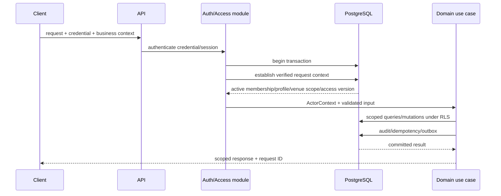

# Tenancy and Authorization Architecture

Status: Phase 3 security boundary baseline

## Security objective

A caller can act only when all required dimensions agree:

```text
authenticated identity/client
AND active business relationship/installation
AND permitted action
AND permitted venue scope
AND valid subject relationship
AND current entitlement where applicable
```

Knowing an opaque identifier is never authorization.

## Data classes

| Class | Examples | Isolation |
|---|---|---|
| Global identity | Users, identity methods, sessions | User/self and restricted identity operations |
| Platform catalog | Plans, permission/profile definitions | Platform-managed, tenant-readable where intended |
| Tenant-owned | Venues, resources, bookings, customers, payments, reports | Mandatory business isolation plus venue/action scope |
| Customer capability | Secure booking representation | Exact token/account-to-booking relationship only |
| Platform administration | Tenant metadata, entitlement changes, platform audit | Platform role; no ordinary tenant content browsing |
| Partner integration | Installation, scopes, webhook configuration | One business + granted venues/actions |

## Request authorization sequence



Authentication can be cached briefly where safe, but access removal/version
must become effective within a defined bound and sensitive commands recheck
current authority.

Better Auth validates first-party browser session mechanics and returns the
opaque authentication subject. The Identity/Access module maps that subject to
the application user and then performs all business, membership, venue-scope,
and entitlement authorization shown above.

## Actor context

Every application command/query receives an immutable server-created context:

```text
request/correlation ID
credential/session/client ID
user ID or integration installation ID
business ID
membership ID/profile or partner scopes
allowed venue IDs / business-wide marker
access/session version
authentication assurance
source IP/device risk metadata where justified
```

The client may request a business/venue context but cannot create the accepted
ActorContext.

## Establishing database context

Use transaction-local context, never persistent connection session state:

```sql
BEGIN;
SELECT app.establish_user_context(
  authenticated_user_id,
  requested_business_id,
  expected_session_version
);
-- scoped statements
COMMIT;
```

The exact function is a Phase 4 proof. It should:

1. execute with narrowly defined security-definer rights;
2. validate active user/session and membership;
3. set `SET LOCAL` business/user/membership context;
4. return only the minimal access profile and venue scope;
5. fail without revealing unrelated business existence;
6. be inaccessible to arbitrary public database clients.

Because `SET LOCAL` ends with the transaction, a pooled connection cannot leak
the previous request’s tenant context. Tenant-owned data access outside the
transaction/context wrapper is prohibited by the data layer and integration
tests.

Workers establish a separate system context from a trusted outbox/job identity
and business ID. A worker cannot accept an arbitrary end-user supplied
`business_id` as a system context.

## Row-Level Security posture

RLS is defense in depth for business isolation:

```sql
USING (business_id = app.current_business_id())
WITH CHECK (business_id = app.current_business_id())
```

Physical policies may be more specific, but complex role and venue rules remain
principally in application authorization to keep domain permissions readable
and avoid expensive/racy RLS subqueries.

Requirements:

- tenant tables enable and, where appropriate, force RLS;
- runtime roles neither own tables nor have `BYPASSRLS`;
- migrations use a distinct deployment role;
- backup/restore tooling intentionally handles RLS and checks complete record
  counts;
- raw SQL paths cannot opt out of context;
- referential-integrity error mapping does not leak another tenant’s existence;
- cross-tenant tests run for single-row, list, aggregate, export, update,
  delete/retire, and background paths.

## Tenant-safe references

Tenant tables use a composite relationship:

```text
(business_id, foreign_entity_id)
    → (business_id, entity_id)
```

This prevents:

- a booking in Business A referencing Resource B;
- a payment allocation crossing tenants;
- a notification pointing to another tenant’s booking;
- a report projection mixing source rows through a bad join.

Venue ownership is similarly checked through tenant-safe references and
application scope.

## Permission model

Stable permission codes are grouped by domain:

```text
booking.read/create/change/cancel
attendance.change
payment.read/collect/verify/reverse/refund
customer.read/create/change/restrict/merge/export
resource.read/configure/block
staff.read/invite/change/remove
report.operational/financial/export/audit
settings.venue/business
subscription.read/manage
platform.tenant_admin/entitlement/audit
```

Fixed MVP profiles map to permission sets in versioned application/platform
configuration. The mapping is not copied as mutable booleans on every user.
Custom role design remains deferred.

Authorization inputs:

```text
profile permission
∩ venue scope
∩ subject/business relationship
∩ business/subscription entitlement
∩ command-specific rule
```

Example: Manager may have `payment.refund`, but only for an assigned venue,
within configured limits, with a reason and auditable source transaction.

## Venue scope

Business-wide owner/finance scope is represented as an explicit scope mode.
Assigned-venue profiles use active venue assignment rows.

Rules:

- scope is resolved using the subject venue, not a client-provided filter alone;
- a business-wide report still includes only the actor’s permitted scope;
- future venues do not automatically become visible unless profile scope is
  business-wide or explicitly assigned;
- venue reassignment/change cannot move a tenant-owned entity across businesses.

## Customer authorization

Customer access uses one of:

- a verified first-party user linked to the tenant-local customer relationship
  and booking;
- a high-entropy secure token for one booking capability;
- an active checkout context for a pending public flow.

Booking code and phone number alone are insufficient. Secure tokens:

- are generated with cryptographic entropy;
- are stored hashed;
- have purpose, expiry, and revocation;
- expose a limited customer representation;
- do not authorize staff endpoints;
- are rotated/revoked after sensitive contact/ownership changes where required.

## Partner and widget authorization

Partner credentials belong to one `IntegrationInstallation`.

Each request checks:

- active credential and installation;
- business binding;
- scope;
- venue scope;
- API version/entitlement;
- rate/abuse policy;
- idempotency for mutations.

Embeddable public widgets never receive a reusable staff or partner secret.
They call public booking endpoints using public configuration and protected
checkout tokens.

## Platform administration

Platform Administrator is not a tenant super-user.

Normal platform tools may access:

- business identity/status metadata;
- subscription/entitlement state;
- operational health/support references;
- administrator audit.

They may not browse ordinary customer, booking, payment, incident, or report
content. Any future support impersonation/data access requires a separate ADR
and time-bounded, reasoned, approved, audited break-glass workflow.

## Access changes and revocation

- Membership profile/scope/state change increments `access_version`.
- User-wide credential recovery or compromise increments `session_version` and
  revokes/deletes the affected Better Auth sessions through the auth adapter.
- Sensitive API requests compare token/session versions with current data.
- WebSocket/push connections, if later used, reauthorize on reconnect and
  receive revocation signals where practical.
- Partner credential rotation supports a bounded overlap only when explicitly
  configured; revocation is immediate.
- Removed access never deletes the actor from historical audit.

## Entitlements versus authorization

Authorization answers **may this actor perform this action?** Entitlement
answers **does this business’s subscription allow this capability/limit?**

Both are required for actions such as activating another staff member.
Entitlement restriction does not grant data access, and a valid permission does
not bypass a plan limit.

Existing-booking operations during subscription restriction use an explicit
entitlement policy, not scattered UI conditions.

## Data leakage controls

- Non-enumerating not-found/forbidden mapping for tenant/customer subjects.
- Allow-listed sort/filter fields prevent inference and query abuse.
- Pagination totals are omitted or scoped where exact counts could leak.
- Error details never include raw constraint keys from another tenant.
- Logs use opaque internal references and redaction.
- Cache keys include business, venue, permission-relevant variation, and data
  version where applicable.
- CDN public cache contains published customer-safe content only.
- Exports are permissioned, scoped, expiring, audited, and stored privately.

## Authorization test matrix

Every protected capability is tested as:

1. allowed profile + allowed venue + own tenant;
2. allowed profile + unassigned venue;
3. wrong profile + assigned venue;
4. suspended/removed membership;
5. another tenant’s valid entity ID;
6. guessed/nonexistent ID with indistinguishable safe response;
7. expired/revoked customer token;
8. partner credential missing one required scope;
9. direct API request bypassing UI;
10. list/report/export/aggregate with mixed-tenant fixtures;
11. worker/job carrying wrong business context;
12. runtime connection without established tenant context.

No Phase 4 module is complete until its matrix passes.
